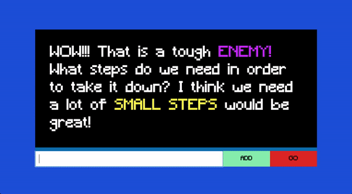
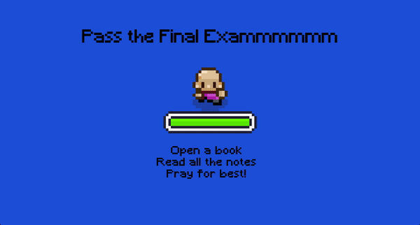

Task-Quest.io(Beta) is inpsired by one of my favorite games, Dragon Quest. This project is about increasing productivity by gaming elements. This application is built by ReactJS and Tailwind. Redux toolkit for stage management.

## Table of contents

- [Overview](#overview)
  - [Screenshot](#screenshot)
  - [Links](#links)
- [My process](#my-process)
  - [Built with](#built-with)
- [Author](#author)

## Overview

In this very first stage, there is a simple to-do-list feature. It encourages user divide their task into few small steps to tackle. By finishing steps, the hero(user) will attack the Enemy(task). And the Enemy will eventually die when all steps are done.

Users should be able to:

- Set up their task and steps.
- Check task's steps.
- Start another task when the Enemy is dead.

### Screenshot

### Links

- Live Site: [Click here](https://task-quest-io.netlify.app/)

### Built with

- React JS
- Tailwind
- Redux Toolkit

## Author

- Website - [Luke Lai](https://lukelai.tech/)
- LinkedIn - [Luke Lai](https://www.linkedin.com/in/luke-lai-309a3522b/)
- Twitter - [@LukeLaiDev](https://www.twitter.com/LukeLaiDev)

