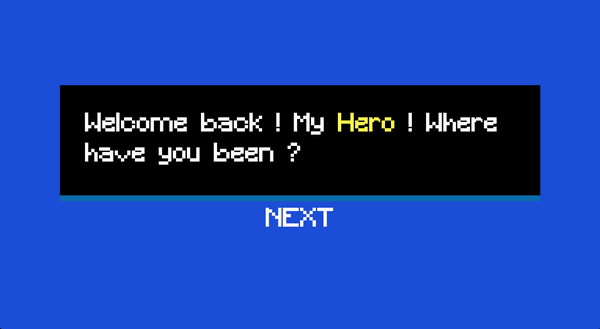

Task-Quest.io(Beta) is inspired by one of my favourite games, Dragon Quest. This project is about increasing productivity through gaming elements. This application is built with ReactJS and Tailwind. Redux toolkit for stage management.

## Table of contents

- [Overview](#overview)
  - [Screenshot](#screenshot)
  - [Links](#links)
- [My process](#my-process)
  - [Built with](#built-with)
- [Author](#author)

## Overview

In this very first stage, there is a simple to-do list feature. It encourages the user to divide their task into a few small steps to tackle. Then, the hero(user) will attack the Enemy(task) by finishing the steps. And the Enemy will eventually die when all steps are done.

Users should be able to:

- Set up their task and steps.
- Check task's steps.
- Start another task when the Enemy is dead.

### Screenshot

### Links

- Live Site: [Click here](https://task-quest-io.netlify.app/)

### Built with

- React JS
- Tailwind
- Redux Toolkit

## Author

- Website - [Luke Lai](https://lukelai.tech/)
- LinkedIn - [Luke Lai](https://www.linkedin.com/in/luke-lai-309a3522b/)
- Twitter - [@LukeLaiDev](https://www.twitter.com/LukeLaiDev)

